# Blog Website

## Description
This project is a sophisticated blog platform designed for advanced engineers. It features a robust backend powered by Node.js and Express, and a dynamic frontend built with React and Vite. The platform supports user authentication, post creation and management, notifications, and a unique chat interface for user interaction.

## Features
- User Authentication: Secure login and signup processes with JWT-based authentication.
- Post Management: Create, update, delete, and view posts with rich content support.
- Comments: Add and view comments on posts.
- Notifications: Real-time notifications for likes, comments, and follows.
- User Profiles: Manage user profiles including avatars and follow relationships.
- Chat System: Interactive chat sessions with real-time message handling.

## Tech Stack
- **Backend**: Node.js, Express, MongoDB, Mongoose, JWT, Multer, Cloudinary
- **Frontend**: React, Vite, TailwindCSS, Axios, React Router, React Toastify
- **Authentication**: JSON Web Tokens (JWT)
- **Database**: MongoDB
- **Cloud Storage**: Cloudinary

## Installation
1. Clone the repository:
   ```bash
   git clone https://github.com/ArifRahaman/blog-website.git
   cd blog-website
   ```
2. Install backend dependencies:
   ```bash
   cd backend
   npm install
   ```
3. Install frontend dependencies:
   ```bash
   cd ../frontend
   npm install
   ```

## Usage Guide
### Backend
1. Configure environment variables in the `backend/.env` file.
2. Start the backend server:
   ```bash
   cd backend
   npm start
   ```

### Frontend
1. Start the frontend development server:
   ```bash
   cd frontend
   npm run dev
   ```

## Environment Variables
- `JWT_SECRET`: Secret key for JWT authentication.
- `MONGO_URI`: MongoDB connection string.
- `CLOUDINARY_URL`: Cloudinary API URL for image uploads.
- `GROQ_KEY`, `DEEPGRAM_KEY`, `DID_API_KEY`: Keys for external API integrations.

## API Reference
### Authentication
- **POST** `/api/auth/signup`: Register a new user.
- **POST** `/api/auth/login`: Authenticate an existing user.
- **GET** `/api/auth/me`: Retrieve authenticated user details.
- **PUT** `/api/auth/me/update`: Update user profile.

### Posts
- **POST** `/api/posts`: Create a new post.
- **GET** `/api/posts`: Retrieve all posts.
- **GET** `/api/posts/:slug`: Retrieve a post by slug.
- **PUT** `/api/posts/:id`: Update a post.
- **DELETE** `/api/posts/:id`: Delete a post.
- **POST** `/api/posts/:id/like`: Like a post.
- **POST** `/api/posts/:id/comments`: Add a comment to a post.

### Comments
- **POST** `/api/comments`: Add a comment.
- **GET** `/api/comments/:postId`: Retrieve comments for a post.

### Notifications
- **GET** `/api/notifications`: Retrieve notifications.
- **POST** `/api/notifications/mark-read`: Mark notifications as read.
- **POST** `/api/notifications/clear`: Clear notifications.

### Chat
- **GET** `/api/chats`: Retrieve chat messages for authenticated user.
- **GET** `/api/chats/:userId`: Retrieve chat messages for a specific user (admin or owner).
- **POST** `/api/chats`: Send a chat message.

## Architecture

```mermaid
flowchart TD
    backend_controllers_commentController_js["controllers/commentController.js"]
    backend_controllers_postControllers_js["controllers/postControllers.js"]
    backend_middleware_auth_js["middleware/auth.js"]
    backend_models_ChatSession_js["models/ChatSession.js"]
    backend_models_Notification_js["models/Notification.js"]
    backend_models_Post_js["models/Post.js"]
    backend_models_User_js["models/User.js"]
    backend_routes_auth_js["routes/auth.js"]
    backend_routes_commentRoutes_js["routes/commentRoutes.js"]
    backend_routes_postRoutes_js["routes/postRoutes.js"]
    backend_routes_posts_js["routes/posts.js"]
    backend_routes_uploadRoutes_js["routes/uploadRoutes.js"]
    backend_routes_users_js["routes/users.js"]
    frontend_src_App_jsx["src/App.jsx"]
    frontend_src_components_AuthContext_jsx["components/AuthContext.jsx"]

    backend_routes_commentRoutes_js --> backend_middleware_auth_js
    backend_routes_commentRoutes_js --> backend_controllers_commentController_js
    backend_controllers_postControllers_js --> backend_models_Post_js
    backend_models_User_js --> backend_models_ChatSession_js
    backend_controllers_commentController_js --> backend_models_Post_js
    backend_middleware_auth_js --> backend_models_User_js
    backend_routes_auth_js --> backend_models_User_js
    backend_routes_auth_js --> backend_middleware_auth_js
    backend_routes_postRoutes_js --> backend_models_Notification_js
    backend_routes_postRoutes_js --> backend_controllers_postControllers_js
    backend_routes_postRoutes_js --> backend_middleware_auth_js
    backend_routes_postRoutes_js --> backend_models_Post_js
    backend_routes_posts_js --> backend_middleware_auth_js
    backend_routes_posts_js --> backend_models_User_js
    backend_routes_posts_js --> backend_models_Post_js
    backend_routes_posts_js --> backend_models_Notification_js
    backend_routes_users_js --> backend_models_User_js
    backend_routes_users_js --> backend_middleware_auth_js
    frontend_src_App_jsx --> frontend_src_components_AuthContext_jsx

    classDef backend fill:#1a1a2e,stroke:#7c6cf8,color:#e8eaf6
    classDef frontend fill:#0d1b2a,stroke:#00e8a2,color:#e8eaf6
    classDef config fill:#1a0a0a,stroke:#f5a623,color:#e8eaf6
    class backend_controllers_commentController_js backend
    class backend_controllers_postControllers_js backend
    class backend_middleware_auth_js backend
    class backend_models_ChatSession_js backend
    class backend_models_Notification_js backend
    class backend_models_Post_js backend
    class backend_models_User_js backend
    class backend_routes_auth_js backend
    class backend_routes_commentRoutes_js backend
    class backend_routes_postRoutes_js backend
    class backend_routes_posts_js backend
    class backend_routes_uploadRoutes_js backend
    class backend_routes_users_js backend
    class frontend_src_App_jsx frontend
    class frontend_src_components_AuthContext_jsx frontend
```


## License
This project is licensed under the MIT License. See the [LICENSE](LICENSE) file for details.

---
> 🤖 *Last automated update: 2026-03-07 00:59:39*