# Blog Website

A full-stack blog website application designed for advanced engineers to explore a robust architecture for creating, managing, and interacting with blog content. This platform supports user authentication, post creation, commenting, and real-time chat functionalities.

## Features

- **User Authentication**: Secure signup and login using JWT.
- **Post Management**: Create, update, delete, and view posts with rich text support.
- **Commenting System**: Engage users with a comment feature on posts.
- **Real-time Chat**: Chat functionality using a topic-aware assistant.
- **Notification System**: Real-time notifications for likes and comments.
- **File Uploads**: Avatar and cover image uploads using Cloudinary.
- **Responsive Design**: Frontend built with React and Vite for a seamless user experience.

## Tech Stack

- **Frontend**: React, React Router, Tailwind CSS, Vite
- **Backend**: Node.js, Express, MongoDB, Mongoose
- **Authentication**: JWT
- **Real-time**: Custom chat implementation with topic-aware AI
- **Cloud Services**: Cloudinary for image uploads
- **Other**: Axios, Toastify for notifications

## Installation

### Prerequisites

- Node.js v14.x or later
- MongoDB database

### Steps

1. Clone the repository:

   ```sh
   git clone https://github.com/ArifRahaman/blog-website.git
   cd blog-website
   ```

2. Install backend dependencies:

   ```sh
   cd backend
   npm install
   ```

3. Install frontend dependencies:

   ```sh
   cd ../frontend
   npm install
   ```

4. Configure environment variables:

   - Duplicate the `.env.example` file in the `backend` directory and rename it to `.env`.
   - Provide your MongoDB connection URI and other required keys.

5. Start the development servers:

   - Backend: 

     ```sh
     cd backend
     npm start
     ```

   - Frontend:

     ```sh
     cd frontend
     npm run dev
     ```

## Usage Guide

- Access the frontend at `http://localhost:3000` (default Vite port).
- Use the web interface to register and login.
- Create new posts and interact with the community via comments and likes.
- Explore real-time chat with the AI assistant.

## Environment Variables

Ensure the following variables are set in your `.env` file for the backend:

- `MONGO_URI`: Your MongoDB connection string
- `JWT_SECRET`: Secret key for JWT
- `CLOUDINARY_URL`: Cloudinary API URL for image uploads
- `GROQ_KEY`: Key for the AI assistant API

## API Reference

### Authentication

- `POST /api/auth/signup`: Register a new user.
- `POST /api/auth/login`: Authenticate a user and return a token.
- `GET /api/auth/me`: Retrieve logged-in user information.
- `PUT /api/auth/me/update`: Update the current user's profile.

### Posts

- `GET /api/posts`: List all posts with pagination.
- `GET /api/posts/:slug`: Retrieve a single post by slug.
- `POST /api/posts`: Create a new post (authenticated).
- `PUT /api/posts/:id`: Update a post (author only).
- `DELETE /api/posts/:id`: Delete a post (author only).
- `POST /api/posts/:id/like`: Like or unlike a post.
- `POST /api/posts/:id/comments`: Add a comment to a post.

### Comments

- `POST /api/comments`: Add a comment to a post.
- `GET /api/comments/:postId`: List comments for a specific post.

### Chats

- `GET /api/chats`: Retrieve chats for the logged-in user.
- `GET /api/chats/:userId`: Retrieve chats for a specific user (admin or owner).
- `POST /api/chats`: Send a chat message.

### Notifications

- `GET /api/notifications`: Retrieve notifications for the logged-in user.
- `POST /api/notifications/mark-read`: Mark notifications as read.
- `POST /api/notifications/clear`: Clear all notifications.

### Uploads

- `POST /api/uploads/avatar`: Upload a user avatar.
- `POST /api/uploads/cover`: Upload a post cover image.

## Contributing

Contributions are welcome! Please fork the repository and submit a pull request for any enhancements or bug fixes.

## License

This project is licensed under the ISC License.

## Architecture

```mermaid
flowchart TD
    backend_controllers_commentController_js["controllers/commentController.js"]
    backend_controllers_postControllers_js["controllers/postControllers.js"]
    backend_middleware_auth_js["middleware/auth.js"]
    backend_models_ChatSession_js["models/ChatSession.js"]
    backend_models_Notification_js["models/Notification.js"]
    backend_models_Post_js["models/Post.js"]
    backend_models_User_js["models/User.js"]
    backend_routes_auth_js["routes/auth.js"]
    backend_routes_commentRoutes_js["routes/commentRoutes.js"]
    backend_routes_postRoutes_js["routes/postRoutes.js"]
    backend_routes_posts_js["routes/posts.js"]
    backend_routes_uploadRoutes_js["routes/uploadRoutes.js"]
    backend_routes_users_js["routes/users.js"]
    frontend_src_App_jsx["src/App.jsx"]
    frontend_src_components_AuthContext_jsx["components/AuthContext.jsx"]

    backend_controllers_commentController_js --> backend_models_Post_js
    backend_routes_commentRoutes_js --> backend_controllers_commentController_js
    backend_routes_commentRoutes_js --> backend_middleware_auth_js
    backend_controllers_postControllers_js --> backend_models_Post_js
    backend_middleware_auth_js --> backend_models_User_js
    backend_routes_auth_js --> backend_models_User_js
    backend_routes_auth_js --> backend_middleware_auth_js
    backend_models_User_js --> backend_models_ChatSession_js
    backend_routes_postRoutes_js --> backend_middleware_auth_js
    backend_routes_postRoutes_js --> backend_models_Post_js
    backend_routes_postRoutes_js --> backend_controllers_postControllers_js
    backend_routes_postRoutes_js --> backend_models_Notification_js
    backend_routes_users_js --> backend_models_User_js
    backend_routes_users_js --> backend_middleware_auth_js
    backend_routes_posts_js --> backend_models_Notification_js
    backend_routes_posts_js --> backend_models_Post_js
    backend_routes_posts_js --> backend_middleware_auth_js
    backend_routes_posts_js --> backend_models_User_js
    frontend_src_App_jsx --> frontend_src_components_AuthContext_jsx

    classDef backend fill:#1a1a2e,stroke:#7c6cf8,color:#e8eaf6
    classDef frontend fill:#0d1b2a,stroke:#00e8a2,color:#e8eaf6
    classDef config fill:#1a0a0a,stroke:#f5a623,color:#e8eaf6
    class backend_controllers_commentController_js backend
    class backend_controllers_postControllers_js backend
    class backend_middleware_auth_js backend
    class backend_models_ChatSession_js backend
    class backend_models_Notification_js backend
    class backend_models_Post_js backend
    class backend_models_User_js backend
    class backend_routes_auth_js backend
    class backend_routes_commentRoutes_js backend
    class backend_routes_postRoutes_js backend
    class backend_routes_posts_js backend
    class backend_routes_uploadRoutes_js backend
    class backend_routes_users_js backend
    class frontend_src_App_jsx frontend
    class frontend_src_components_AuthContext_jsx frontend
```



---
> 🤖 *Last automated update: 2026-03-10 22:53:46*